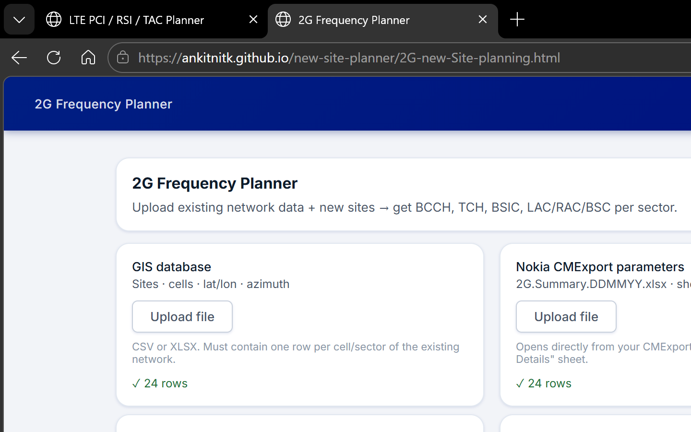
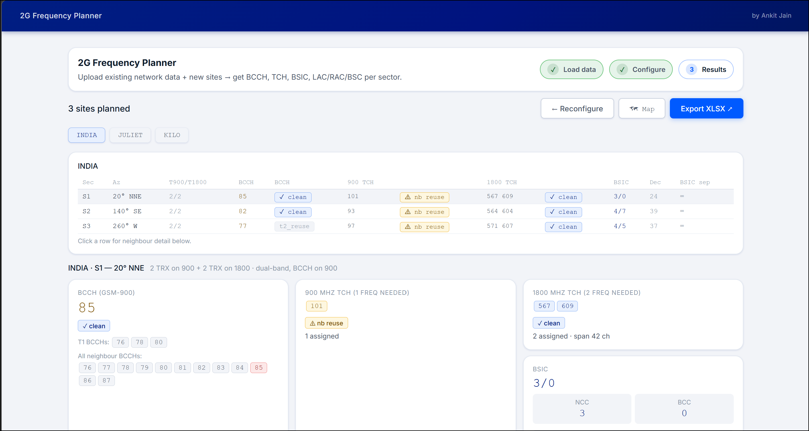
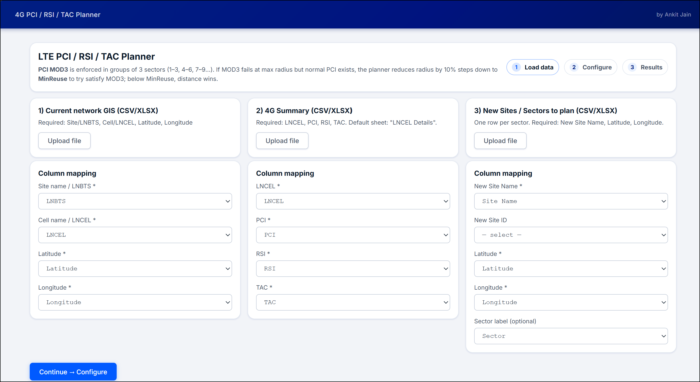
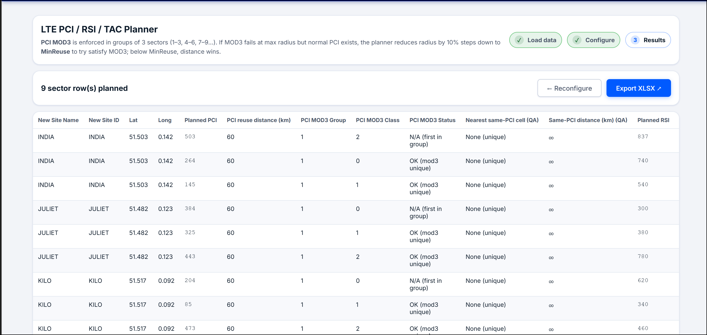

# Network Planning Tools

[](https://ankitnitk.github.io/new-site-planner/)
[](https://ankitnitk.github.io/new-site-planner/2G-new-Site-planning.html)
[](https://ankitnitk.github.io/new-site-planner/4G-PCI-RSI-TAC%20planning.html)

> **Single-file HTML tools for GSM and LTE radio network planning.**  
> No installation. No server. No sign-up. Just open in a browser, upload your exports, and get a planned frequency/PCI output in seconds.

**Author:** Ankit Jain

---

## Tools

| Tool | Description | Live |
|------|-------------|------|
| **2G Frequency Planner** | Assigns BCCH, BSIC (NCC/BCC) and TCH frequencies for new GSM sites against an existing network | [Open ↗](https://ankitnitk.github.io/new-site-planner/2G-new-Site-planning.html) |
| **4G PCI / RSI / TAC Planner** | Assigns LTE PCI (with MOD3 enforcement), RSI and TAC for new eNB sites | [Open ↗](https://ankitnitk.github.io/new-site-planner/4G-PCI-RSI-TAC%20planning.html) |
| **Offline 2G Planner** | Same as 2G planner but all JS bundled locally — no internet needed | [Open ↗](https://ankitnitk.github.io/new-site-planner/index_offline.html) |

---

## Screenshots

### 2G Frequency Planner

*Step 1 — Upload GIS database, CMExport parameters, and new sites file*


*Results — BCCH, BSIC, TCH and neighbour plan per sector, exportable to XLSX*

### 4G PCI / RSI / TAC Planner

*Step 1 — Upload GIS, 4G Summary and new sites file*


*Results — Planned PCI (with MOD3 status), RSI and TAC per sector, exportable to XLSX*

> 📸 **To add your own screenshots:** take a screenshot of each step, save to `docs/screenshots/` and push. The image names above are already wired up.

---

## Why use these tools?

RF planning engineers typically do new-site frequency and PCI assignment manually — cross-referencing spreadsheets, checking reuse distances by eye, and iterating through neighbour lists. These tools automate the constraint logic:

- **Correct by construction** — reuse distances, tier constraints, MOD3 groups, RSI gaps and BSIC uniqueness are all enforced algorithmically, not checked after the fact
- **Instant** — plans hundreds of sectors in seconds, with a live progress bar
- **Portable** — a single `.html` file you can email, share on SharePoint, or open offline
- **Transparent** — every assignment shows *why* it was made (tier mode, reuse distance, MOD3 status)
- **Exportable** — one-click XLSX output ready for NMS import or review

---

# 2G Frequency Planner

A single-file browser-based tool for planning GSM (2G) radio frequencies, BSIC, and neighbour lists for new sites — built on top of an existing network's GIS and parameter exports.

---

## How to Use

1. Open the tool in any modern browser (internet required on first load for CDN libraries).
2. **Step 1 — Load data:** upload three files:
   - **GIS database** — one row per existing cell/sector; must contain site name, cell name, latitude, longitude, azimuth.
   - **CM Export / Summary sheet** — one row per cell; must contain cell name, BCCH, TCH/MA list, NCC, BCC (or BSIC). Optionally LAC, RAC, BSC.
   - **New sites CSV** — one row per sector to plan; must contain site name, latitude, longitude, azimuth, TRX count for 900 and 1800.
3. **Step 2 — Configure** algorithm parameters and ARFCN pools.
4. **Step 3 — Plan** and review results per site/sector. Export to Excel.

> **Offline use:** `index_offline.html` bundles all JS libraries locally — no internet required. Open it directly.

---

## Algorithm Parameters

| Parameter | Default | Description |
|-----------|---------|-------------|
| Search radius (km) | 10 | Maximum distance to consider any cell as a candidate neighbour or frequency conflict |
| 1st tier radius (km) | 5 | Distance cap for T1 neighbour classification and strict BCCH avoidance |
| BSIC uniqueness radius (km) | 50 | Target radius for BCCH+BSIC triplet uniqueness; shrinks per BCCH tier if needed (see BSIC Planning) |
| Beam width (°) | 65 | Half-power beam width used for overlap scoring |
| NCC pool | 0-7 | Allowed NCC values (accepts ranges and lists, e.g. `2,4,6` or `0-7`) |
| Max external neighbours | 10 | Maximum neighbours per sector in the export (intra-site always included) |
| Planning passes | 3 | Number of multi-pass Jacobi iterations across all sites (see Technical Notes) |
| Band 1 (GSM-900) BCCH pool | 76-87 | ARFCN pool for BCCH selection — comma/range format, e.g. `76-87` or `78,80,86` |
| Band 1 (GSM-900) TCH pool | 88-101, 123, 124 | ARFCN pool for TCH selection (same format) |
| Band 2 (GSM-1800) BCCH pool | 562,563,610 | Used as BCCH source for 1800-only sectors (0 TRX on 900) |
| Band 2 (GSM-1800) TCH pool | 564-571,601-610 | 1800-band TCH pool; also used for dual-band (900+1800) cells |

---

## Neighbour Tier System

Neighbours are classified by hop-count on the beam-overlap graph. All classification is **directional** (based on azimuth and beam width), not just distance.

### Tier definitions

| Tier | Condition |
|------|-----------|
| **Intra-site** | Other sectors of the same planned site (rank 0 in export) |
| **T1** | Within `1st tier radius` AND has direct beam overlap with the source sector (after fine-tuning) |
| **T2** | Beyond `1st tier radius` but still has direct beam overlap, OR co-site with a T1 cell |
| **T3** | BFS one hop further — overlaps any T1/T2 cell, or is co-site with a T1/T2 cell |

### Direct beam overlap definition

A candidate cell qualifies as having direct beam overlap if **both**:
- **fwdS > 5%** — source sector's beam points toward the candidate  
  `fwdS = max(0, 1 − angleDiff(bearing, sourceAzimuth) / beamWidth)`
- **revS > 5%** — candidate's beam points back toward the source  
  `revS = max(0, 1 − angleDiff(reverseBearing, candidateAzimuth) / beamWidth)`

**Intra-site bridge exception:** a candidate with strong revS (≥ 40%) toward the planned site can also qualify as T1/T2 if a *sibling sector* of the planned site has fwdS > 5% toward it — modelling the free intra-site handover hop.

### Tier fine-tuning (applied after initial classification)

Three post-processing stages refine the raw T1/T2 assignment:

| Stage | Rule | Badge |
|-------|------|-------|
| **Demote** | Raw T1 with one side ≤ 5% AND stronger side < 45% → T2 | `T2↓` |
| **Upgrade** | Raw T2 with both fwdS > 60% AND revS > 60% → T1 | `T1↑` |
| **Shadow check** | Raw T1 candidate C is demoted if a closer confirmed-T1 cell B already covers C's direction, meaning C is not in the true first reachable ring. Three shadow cases: (1) B's beam points toward C (`fwdS(B→C) > 40%`); (2) both are back-beam cells (fwdS ≈ 0) within `beamWidth/3` bearing; (3) both are front-facing within `beamWidth/3` bearing — closer one wins | `T2~` |

Co-site cells of the same neighbour site are never shadowed against each other.

### Neighbour ranking (within each tier)

```
nbRelevance = distance / (1 + (fwdS + revS) × 3)
```

Lower score = higher priority. Cells with **both** fwdS ≤ 5% and revS ≤ 5% are always ranked after cells with any meaningful overlap on at least one side. Within each overlap bucket, the relevance formula applies.

---

## BCCH Planning

BCCH selection uses a **four-pass cascade** with progressively relaxed constraints.

| Pass | Mode label | Blocked BCCHs |
|------|-----------|---------------|
| 1 | `clean` | Intra-site ±1, all T1 BCCHs, all T2 BCCHs |
| 2 | `t2_reuse` | Intra-site ±1, all T1 BCCHs (T2 reuse allowed) |
| 3 | `t1_reuse` | Intra-site ±1 only (T1+T2 reuse allowed) |
| 4 | `forced` | Nothing blocked (pool exhausted) |
| — | `impossible` | Every BCCH in the configured pool is already used by another planned sector |

**Blended candidate scoring:** within each pass, BCCH candidates are ranked by `sep × (1 − worstOverlap)`, where `sep` is the minimum ARFCN distance to any neighbour's BCCH and `worstOverlap` is the highest beam overlap (max of fwdS and revS) across all neighbour cells that share that BCCH. A free BCCH (not used by any neighbour) scores purely on separation; a reused BCCH is penalised proportionally to its worst-case geometric conflict. Ties are broken randomly to spread load across equivalent candidates.

**Global BCCH uniqueness:** no two planned sectors may ever share the same BCCH. This is enforced globally across all sites in all planning passes — even `forced` mode never assigns a BCCH already allocated to another sector. If the pool is exhausted, `bcchMode = impossible` is reported rather than silently duplicating.

**Intra-site adjacency:** the intra-site blocked set includes not just exact BCCH values of other sectors but also their ±1 adjacent ARFCNs, to prevent BCCH–TCH adjacent channel interference within the same site.

---

## BSIC Planning (NCC + BCC)

BSIC = NCC × 8 + BCC (6-bit value, range 0–63).

- NCC is selected from the configured **NCC pool** (default 0–7).
- BCC is selected from 0–7.
- Both are chosen **jointly with BCCH** to guarantee the `(BCCH, NCC, BCC)` triplet is unique within `bsicRadius`.
- Selection order within NCC pool and BCC range is **randomised per sector** to avoid systematic low-value bias.

**BCCH tier takes absolute priority over BSIC uniqueness radius.** For each BCCH tier (clean → t2_reuse → t1_reuse → forced), the planner searches for a free `(NCC, BCC)` slot at the configured `bsicRadius`. If none is found, the radius is reduced by **80%** and retried (`50 km → 40 km → 32 km → …`) — *still within the same BCCH tier*. Only when no BCCH in the current tier can achieve BSIC uniqueness at any radius does the planner fall to the next (worse) BCCH tier. This means BCCH cleanliness is never sacrificed just to maintain a larger BSIC repeat distance.

After selection, the **actual minimum repeat distance** is computed — the nearest existing or previously-planned cell that shares the same `(BCCH, NCC, BCC)` triplet. This is displayed in:
- **Results table:** "BSIC sep" column — km or ∞ if fully unique; values < 10 km highlighted in amber.
- **BSIC detail card:** "Min BSIC+BCCH repeat dist" tile below NCC/BCC.
- **Excel export:** `BSIC_Repeat_km` column in Sheet 1 (blank = fully unique).

---

## TCH Planning

TCH selection uses a **six-pass cascade** per sector. Each pass tries a progressively relaxed set of constraints:

| Pass | Mode label | NB conflict | Intra-site BCCH adj | Intra-site TCH exact reuse | Intra-site TCH adj |
|------|-----------|-------------|--------------------|--------------------------|--------------------|
| 1 | `clean` | ✗ avoided | ✗ avoided | ✗ avoided | ✗ avoided |
| 2 | `site_adj` | ✗ avoided | ✗ avoided | ✗ avoided | ✓ allowed |
| 3 | `nb_reuse` | ✓ allowed | ✗ avoided | ✗ avoided | ✗ avoided |
| 4 | `nb_reuse_adj` | ✓ allowed | ✗ avoided | ✗ avoided | ✓ allowed |
| 5 | `site_reuse` | ✓ allowed | ✗ avoided | ✓ allowed | ✗ avoided |
| 6 | `reuse` | ✓ allowed | ✗ avoided | ✓ allowed | ✓ allowed |
| — | `impossible` | Every ARFCN in the configured pool for this band is already used by another planned sector |

**Global TCH uniqueness:** no two planned sectors may ever share the same TCH frequency. This constraint is enforced before any pool filtering — globally used ARFCNs are stripped from the pool at the start of each `planTCH` call, regardless of which pass is active. Adjacent ARFCNs (±1) to other sectors' TCHs are still allowed. If the band pool is fully exhausted by other sectors, `tch900Mode` / `tch1800Mode` = `impossible` is reported.

**Intra-sector adjacency (minSep = 2) is never relaxed** — two ARFCNs within the same cell must always differ by at least 2 to avoid adjacent channel interference (ACI) within the TRX chain.

**BCCH–TCH adjacency within a site:** the intra-site BCCH set used to filter TCH candidates is expanded to ±1, so no TCH of any sector at the same site can be adjacent to any BCCH of any other sector at that site.

**Round-robin assignment across sectors:** instead of assigning all TCHs to S1 then all to S2 then S3, the planner assigns one TCH per sector per band in rotation. The sector order within each round is **shuffled randomly** so no single sector always gets first pick of the clean pool. Each pick is made with full awareness of all other sectors' already-committed TCHs.

**Uniform random TCH selection:** within each pass, the planner enumerates all valid combinations of the required number of TCHs (respecting the minSep ≥ 2 constraint) and picks one **uniformly at random** using reservoir sampling. This gives every valid combination an equal probability, avoiding any bias toward low or high ARFCNs. When the combination count exceeds 60 000, a randomised spread-select heuristic is used instead (random rotation of the pool, greedy selection).

**Co-site existing sector awareness:** when planning a new sector on an already-existing site (detected by co-location within 0.05 km), the existing sectors' BCCHs and TCHs are pre-loaded into the intra-site register. The new sector therefore avoids conflicts and adjacency with them exactly as it would with other newly planned sectors of the same site.

---

## LAC / RAC / BSC Planning

All sectors of the same planned site receive **identical** LAC, RAC, and BSC values.

### Rule priority

1. **Existing site** (any GIS cell within 0.05 km of the planned location has LAC/RAC/BSC data) → inherit directly from those co-located cells (majority vote if multiple values present). Tier-1 neighbours are ignored.

2. **New site with T1 neighbours** → pool the T1 neighbours of **all planned sectors combined**, then:
   - Find the most frequent (LAC, RAC, BSC) combination.
   - Tie-break: the combination whose nearest representative cell is closest to the planned site wins.

3. **New site with no T1 neighbours** (isolated site or all T1 candidates lack LAC/RAC/BSC) → inherit from the **nearest cell** in the working network that has LAC/RAC/BSC data, with no distance or beam-overlap constraint.

LAC/RAC/BSC values are sourced from the CM Export / Summary sheet via the column mapping (auto-detected or manually selected).

---

## Export Format

The exported `freq_plan.xlsx` contains two sheets:

### Sheet 1 — Freq Plan

One row per planned sector.

| Column | Description |
|--------|-------------|
| Site, SiteID, Cell, Sector, Azimuth | Site/sector identity |
| TRX_900, TRX_1800 | TRX counts |
| BCCH_Band | Band carrying the BCCH |
| BCCH | Planned BCCH ARFCN |
| BCCH_Mode | Planning quality (`clean`, `t2_reuse`, `t1_reuse`, `forced`) |
| TCH_900_Count, TCH_900, TCH_900_Mode | 900-band TCH list and quality |
| TCH_1800_Count, TCH_1800, TCH_1800_Mode | 1800-band TCH list and quality |
| NCC, BCC, BSIC | Planned BSIC (BSIC decimal = NCC×8 + BCC) |
| BSIC_Repeat_km | Minimum distance (km) to the nearest existing or previously-planned cell sharing the exact same (BCCH, NCC, BCC) triplet; blank = fully unique in the working network |
| LAC, RAC, BSC | Planned location/routing area and BSC |

### Sheet 2 — Neighbour Plan

One row per neighbour pair (intra-site rank 0, external rank 1, 2, 3 …).

| Column | Description |
|--------|-------------|
| Source_Cell, Target_Cell | Neighbour pair |
| Rank | 0 = intra-site; 1+ = external, ordered by relevance score |
| Distance_km | Distance between sites |
| Tier | `Intra-site`, `1st`, `1st(upgraded)`, `2nd`, `2nd(downgraded)`, `2nd(shadowed)`, or `3rd` |
| Fwd_Overlap_pct | Source beam overlap toward target (%) |
| Rev_Overlap_pct | Target beam overlap back toward source (%) |
| Source_BCCH, Neighbour_BCCH | BCCHs for conflict checking |
| Source_TCH, Neighbour_TCH | TCH lists |

Both sheets have **blue headers** (frozen below row 1) and **freeze panes** after the primary key column.

---

## Technical Notes

- **No server, no install** — pure client-side HTML/JS. Double-click to open in any browser.
- **Online version** (`2G-new-Site-planning.html`): loads React, Babel, and xlsx-js-style from CDN — internet required on first load.
- **Offline version** (`index_offline.html`): all JS libraries bundled locally in `libs/` — works without internet. Leaflet map still requires internet for tile rendering.
- **Randomisation:** NCC, BCC, BCC order, BCCH tie-breaking, sector round-robin order, and TCH combination selection are all randomised per planning run to avoid systematic bias and produce varied-but-valid results across multiple runs.
- **Multi-pass Jacobi iteration:** sites are first planned sequentially (pass 1). In passes 2+, each site is re-planned using all *other* sites' frequencies from the previous pass as constraints — so no site is permanently disadvantaged by planning order. The best-scoring pass (fewest degraded BCCH sectors, then fewest T1 BCCH conflicts) is returned. Configurable via the `Planning passes` parameter (default 3).
- **Pass 2+ site locking:** sites that achieved a fully `clean` BCCH assignment in the previous pass AND have no other planned site as a T1/T2 neighbour are locked and skipped in subsequent passes. Their planning environment cannot change, so re-running would produce identical results. This significantly reduces computation time for large batches.
- **Live progress bar:** during planning the Plan button is replaced by a progress bar showing current pass, site count, locked site count, and overall percentage. The event loop is yielded between sites so the UI stays responsive throughout.
- **Badge accuracy:** after all sectors of a site are planned, a post-processing step upgrades any sector's TCH mode badge to `~ x-sector adj` if a sibling sector's TCH is adjacent (±1), regardless of which sector was planned first.

---

---

# 4G PCI / RSI / TAC Planner

A single-file browser-based tool for planning LTE Physical Cell ID (PCI), Root Sequence Index (RSI), and Tracking Area Code (TAC) for new eNB sites — built on top of an existing network's GIS and 4G parameter exports.

## How to Use

1. Open `4G-PCI-RSI-TAC planning.html` in any modern browser.
2. **Step 1 — Load data:** upload three files:
   - **Current network GIS** — one row per existing cell/sector; must contain site name (LNBTS), cell name (LNCEL), latitude, longitude.
   - **4G Summary sheet** — one row per cell; must contain LNCEL, PCI, RSI, TAC. The planner auto-selects the sheet named "LNCEL Details" if present.
   - **New Sites file** — one row per sector to plan; must contain site name, latitude, longitude. Sector label column is optional.
3. **Step 2 — Configure** planning parameters.
4. **Step 3 — Plan** and review results. Export to Excel.

> The tool merges the GIS and Summary files by cell name (LNCEL) to build the working network. All three inputs are required before planning can begin.

---

## Algorithm Parameters

| Parameter | Default | Range | Description |
|-----------|---------|-------|-------------|
| Min reuse distance (km) | 20 | > 0 | Minimum separation between cells assigned the same PCI or RSI. The planner starts at 3× this value and steps down by 10% increments. |
| Min RSI gap (within site) | 20 | > 0 | RSI values assigned to sectors of the same site must differ by at least this amount (on top of being unique). |
| PCI min / max | 0 / 503 | 0–503 | Allowed PCI pool. LTE specifies 504 PCIs (0–503). Restrict to a sub-range to limit planned site PCIs to an operator-reserved block. |
| RSI min / max | 0 / 837 | 0–837 | Allowed RSI pool. LTE Zadoff-Chu root sequence indices are 0–837. |

---

## PCI Planning — MOD3 Rule

LTE requires that sectors sharing strong overlap have distinct PCI mod3 classes (0, 1, 2) to avoid pilot contamination from the primary synchronisation signal (PSS).

### Groups of 3 sectors

The planner enforces MOD3 in **blocks of 3 consecutive sectors per site**: sectors 1–3 form group 1, sectors 4–6 form group 2, and so on. Within each group, the planner tries to assign three PCIs with distinct mod3 classes.

### Assignment algorithm

For each sector (in site-sequential order):

1. Build candidate list from `rotatedRange(pciMin, pciMax)` — a randomly rotated array of the entire PCI pool.
2. For each reuse radius R (starting at `3 × minReuseKm`, stepping down 10% per iteration, floor at `0.1 × minReuseKm`):
   - Collect all cells (existing + already-planned) within R km. Remove their PCIs and all intra-site already-assigned PCIs from candidates.
   - **First sector in group** (or single-sector group): pick via spread scoring (maximise minimum distance to existing used PCIs). MOD3 is N/A.
   - **Subsequent sectors in group**: first attempt to find a candidate with a different mod3 class from the others already in the group. If a MOD3-compliant candidate exists at this R, assign it.
   - If MOD3 is not possible at R but normal candidates exist: record the best normal candidate (highest-isolation, first R where candidates appear) as a fallback, then reduce R and retry MOD3.
   - **Constraint:** radius reduction for MOD3 stops at `minReuseKm`. Below that, distance protection is not sacrificed further for MOD3.
3. If MOD3 was never possible at any radius ≥ `minReuseKm`: assign the normal fallback candidate (highest-isolation, no MOD3 constraint).

### MOD3 status values

| Status | Meaning |
|--------|---------|
| `N/A (group size 1)` | Only one sector in the group — MOD3 does not apply |
| `N/A (first in group)` | First sector assigned in the group — reference point for the group's mod3 classes |
| `OK (mod3 unique)` | MOD3 satisfied at the maximum (3× minReuse) radius |
| `OK (mod3 via reduced radius)` | MOD3 satisfied after reducing radius (still ≥ minReuse) |
| `Fallback (mod3 not possible)` | No MOD3-compliant PCI found at any radius ≥ minReuse; best normal PCI assigned |
| `Not possible` | No free PCI exists at any radius (pool exhausted) |

### Spread scoring and tie-breaking

When multiple candidates are valid, the planner picks the one with the **largest minimum distance** to any already-used PCI in the candidate set — maximising spectral separation. Ties are broken uniformly at random using reservoir sampling (`seen++; if (Math.random() < 1/seen) choose current`), so every equally good candidate has equal probability.

---

## RSI Planning

RSI (Root Sequence Index) is used by the LTE PRACH (random access channel). Sectors with the same RSI within a close range cause PRACH ambiguity.

### Constraints

- **Intra-site uniqueness:** sectors of the same site can never share an RSI (hard constraint).
- **Intra-site gap:** RSI values within the same site must differ by at least `minRsiGap`. This prevents Zadoff-Chu root sequences that are close in index from producing nearly-identical preamble sets.
- **Reuse distance:** no RSI may be reused within the same radius cascade used for PCI (`3 × minReuseKm` → `0.1 × minReuseKm`).

### Assignment

The pool is `rotatedRange(rsiMin, rsiMax)`. For each radius R (same cascade as PCI), the planner filters out:
1. RSIs used by any cell within R km (existing or planned).
2. RSIs already assigned to other sectors of the same site.
3. RSIs that would violate the intra-site `minRsiGap`.

The first radius where a valid candidate exists is used. Spread scoring with reservoir-sampling tie-break applies (same as PCI).

---

## TAC Planning

Tracking Area Code (TAC) defines the tracking area — a grouping of cells for UE paging efficiency. TAC boundaries are set by the existing network topology, not by new site additions.

**Rule:** each new site inherits the TAC of its **nearest existing site** (by haversine distance to site centroid). If the nearest existing site has multiple TAC values (mixed cells), the most frequent TAC is used; ties are broken by smallest TAC value.

TAC is the same for all sectors of the same new site. It is looked up from `baseCells` (existing network) only — other planned-but-not-yet-existing sites do not influence each other's TAC.

---

## Output Columns

| Column | Description |
|--------|-------------|
| New Site Name | Site identifier from the New Sites input |
| New Site ID | Site ID column if present in the New Sites input (else same as name) |
| Lat / Long | Site coordinates |
| Planned PCI | Assigned PCI, or `Not possible` if pool exhausted |
| PCI reuse distance (km) | Actual reuse radius used for this PCI assignment |
| PCI MOD3 Group | Block-of-3 group number (1 = sectors 1–3, 2 = sectors 4–6, …) |
| PCI MOD3 Class | `mod3(PCI)` — 0, 1, or 2 |
| PCI MOD3 Status | See MOD3 status values table above |
| Nearest same-PCI cell (QA) | Cell name of the nearest existing or planned cell with the same PCI |
| Same-PCI distance (km) (QA) | Distance to that cell; `∞` if the PCI is globally unique |
| Planned RSI | Assigned RSI, or `Not possible` if pool exhausted |
| RSI reuse distance (km) | Actual reuse radius used for this RSI assignment |
| Nearest same-RSI cell (QA) | Cell name of the nearest cell with the same RSI |
| Same-RSI distance (km) (QA) | Distance to that cell; `∞` if globally unique |
| Planned TAC | Inherited TAC from nearest existing site |
| Nearest Site Name | Name of the existing site whose TAC was inherited |
| Remark | Warning if any existing site within MinReuse has unknown PCI or RSI (may affect planning quality) |

---

## Technical Notes (4G)

- **No server, no install** — pure client-side HTML/JS. Open directly in any modern browser.
- **Online tool** loads React, Babel, and xlsx-js-style from CDN — internet required on first load.
- **Column auto-detection:** the planner recognises common column name variants for LNBTS, LNCEL, lat, lon, PCI, RSI, TAC automatically. Manual override via the column mapping dropdowns.
- **Async progress bar:** planning yields to the browser between sectors, keeping the UI responsive. A live progress bar shows current site name and percentage.
- **Randomised pool rotation:** `rotatedRange()` starts at a random offset within the pool so repeated planning runs produce varied-but-valid results without systematic low-value bias.
- **Existing + planned cells:** during planning, already-planned sectors are added to the working set so later sites see them as constraints — avoiding conflicts between newly planned cells, not just conflicts with the existing network.

---

## Changelog

### 2026-05-04 (update 2)

#### Fix: BCCH tier takes absolute priority over BSIC uniqueness radius
Previously the BSIC search loop iterated **radius-first, tier-second**: at each radius level it tried all BCCH tiers in order and stopped on the first hit. In a dense network where all 64 NCC×BCC combinations for every `t2_reuse` BCCH candidate were exhausted at 50 km, the algorithm would accept a `t1_reuse` BCCH simply because that tier happened to have a free BSIC slot at 50 km — even though the `t2_reuse` candidate would have worked at 40 km.

New order: **tier-first, radius-second**. For each BCCH tier the BSIC uniqueness radius shrinks independently (50 km → 40 km → 32 km → …) before falling to the next (worse) BCCH tier. BCCH cleanliness is never sacrificed just to maintain a larger BSIC repeat distance — only NCC/BCC adjust to fit within whatever radius is achievable.

#### Live progress bar during planning
Large batches previously blocked the browser event loop, making the page appear frozen. The planning engine is now async: it yields to the browser between each site, allowing React to redraw a live progress bar showing `Pass N/M · site X/Y · K locked ⚡ · XX%`. The Back button is disabled while planning is in progress.

#### Multi-pass site locking
Sites that achieved a `clean` BCCH in the previous pass and have no other planned site as a neighbour are locked and copied directly in passes 2+, skipping the expensive `planOneSite` call. The progress bar shows the locked count so it is clear how many sites are being fast-copied.

#### Uniform random TCH selection (reservoir sampling)
`optimalTCHSelect()` previously biased selection toward combinations that minimised distance to sibling sectors' committed TCHs. It now uses **reservoir sampling** (`seen++; if (Math.random() < 1/seen) choose current`) to give every valid combination — all subsets of size `count` from the eligible pool that satisfy the minSep ≥ 2 constraint — an exactly equal probability. This removes all distance/spread bias. The large-combination fallback (`spreadSelect`) similarly starts from a random position in the pool rather than a fixed midpoint.

#### Blended BCCH candidate scoring
BCCH candidates were previously sorted purely by frequency separation from neighbours. They are now ranked by `sep × (1 − worstOverlap)`, where `worstOverlap = max(fwdS, revS)` across all neighbour cells sharing that BCCH. A free BCCH scores the same as before; a reused BCCH is down-weighted proportionally to its worst-case geometric conflict. This makes the planning *more likely* to avoid high-overlap reuse without forcing it — frequency separation still dominates when no geometric information is available.

#### Round-robin sector order shuffle
The sector order within each TCH round-robin round is now shuffled randomly, so no single sector always gets first pick of the clean pool across all rounds.

#### 1800-only cell BCCH exclusion in TCH planning
For 1800-only cells (no 900-band TRX), the BCCH is on the 1800 band. The intra-site BCCH set (`inSiteBCCHSet`) is now correctly passed to the 1800-band TCH planner for these cells, preventing any 1800 TCH from being adjacent to the 1800 BCCH. For dual-band cells the 900 BCCH set is irrelevant to 1800-band ARFCNs and is no longer passed unnecessarily.

---

### 2026-05-04

#### Intra-site frequency uniqueness (BCCH + TCH)
No two sectors of the same site may ever be allocated the same BCCH or the same TCH frequency. Adjacent (±1) is still allowed.

- **BCCH:** introduced `inSiteExact` — a set of exact BCCHs already assigned to sibling sectors within the same `planOneSite` call. All four BCCH cascade passes (including `forced`) now filter against `inSiteExact`, so a sibling's BCCH can never be reused even if the BSIC differs. The absolute last-resort fallback similarly filters against `inSiteExact` and reports `bcchMode = impossible` only if the pool is truly exhausted.
- **TCH:** `poolE` (last-resort TCH pool) now also excludes `otherSectorTCH`, preventing exact intra-site TCH reuse even when all softer constraints are relaxed.

#### BSIC+BCCH minimum repeat distance
After the `(BCCH, NCC, BCC)` triplet is selected for each sector, the planner computes the **actual nearest repeat distance** — the haversine distance to the closest cell in the working network that carries the identical triplet. Reported in three places: results table ("BSIC sep"), BSIC detail card ("Min BSIC+BCCH repeat dist"), and Excel export (`BSIC_Repeat_km`).

#### Tier fine-tuning shadow check — beamWidth/3 bearing bucket
The angular window used to determine whether two cells are "in the same direction" from the planned site was widened from `beamWidth/4` to `beamWidth/3`. This reduces false shadow demotion of cells that are meaningfully separated in bearing while still suppressing back-ring candidates that are truly co-directional.

#### Neighbour ranking — zero-overlap cells ranked last
Cells with **both** `fwdS ≤ 5%` and `revS ≤ 5%` are always ranked after any cell that has overlap on at least one side, regardless of distance.
